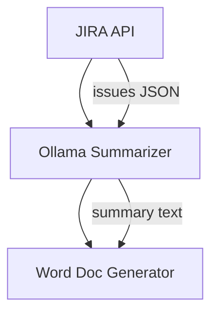

# System Design: Automated JIRA Reporting to Word Document

## Overview
This system automates the process of retrieving issues from JIRA, summarizing them using a local Ollama LLM, and generating a Word document report.

---

## Components

### 1. JIRA API Integration
- **Function**: Fetch issues using JQL
- **Authentication**: Personal Access Token (PAT)
- **Tech**: HTTP request to JIRA REST API

### 2. Summarization via Ollama
- **Function**: Generate summaries for each JIRA issue
- **Interface**: HTTP POST to Ollama's local API
- **Model**: LLaMA 3 or similar (running locally)
- **Endpoint**: `http://localhost:11434/api/generate`

### 3. Word Document Generation
- **Function**: Compile summaries into a `.docx` file
- **Library**: `python-docx`

### 4. Configuration Validation
- **Function**: Validate environment variables and dependencies
- **Script**: `validate_config.py`

### 5. Connectivity Testing
- **Function**: Test JIRA and Ollama API connections
- **Script**: `test_setup.py`

---

## Suitable Tech Stack

### Programming Language
- **Python**: Simple syntax, mature libraries, strong community support

### Key Libraries
- **API Requests**: `requests`
- **Word Generation**: `python-docx`
- **Environment Config**: `python-dotenv`

### Optional Tools
- **n8n**: Low-code automation and scheduling
- **PM2 / systemd**: For running scripts as background jobs
- **GitHub Actions / cron**: For scheduled execution

### Runtime
- Python ≥ 3.9
- Ollama running locally with `llama3` model loaded

---

## Sample Python Script

```python
import os
import requests
from docx import Document
from dotenv import load_dotenv

load_dotenv()

JIRA_TOKEN = os.getenv("JIRA_TOKEN")
JIRA_URL = os.getenv("JIRA_URL")
JQL = os.getenv("JIRA_JQL")

OLLAMA_URL = "http://host.docker.internal:11434/api/generate"

def fetch_issues():
    headers = {
        "Authorization": f"Bearer {JIRA_TOKEN}",
        "Accept": "application/json"
    }
    params = {"jql": JQL, "maxResults": 50}
    response = requests.get(f"{JIRA_URL}/rest/api/3/search", headers=headers, params=params)
    return response.json().get("issues", [])

def summarize(text):
    body = {
        "model": "llama3",
        "messages": [{"role": "user", "content": f"Summarize this JIRA issue:\n{text}"}]
    }
    response = requests.post(OLLAMA_URL, json=body)
    return response.json().get("message", {}).get("content", "")

def generate_doc(summaries):
    doc = Document()
    doc.add_heading("JIRA Summary Report", 0)
    for i, summary in enumerate(summaries, 1):
        doc.add_heading(f"Issue {i}", level=2)
        doc.add_paragraph(summary)
    doc.save("JIRA_Summary_Report.docx")

if __name__ == "__main__":
    issues = fetch_issues()
    summaries = []
    for issue in issues:
        content = f"{issue['fields']['summary']}\n\n{issue['fields'].get('description', '')}"
        summary = summarize(content)
        summaries.append(summary)
    generate_doc(summaries)
```

Create a `.env` file with the following:
```env
JIRA_TOKEN=your_token
JIRA_URL=https://yourdomain.atlassian.net
JIRA_JQL=project = "ABC" AND updated >= "2025-07-01"
```

---

## Workflow Diagram (Mermaid)



---

## Data Flow

1. **Retrieve JIRA Issues**
   - Input: JQL string
   - Output: JSON with issue data (summary, description, status)

2. **Summarize Each Issue**
   - Input: Concatenated text (`summary + description`)
   - Output: AI-generated summary from Ollama

3. **Generate Word Report**
   - Input: List of summaries
   - Output: `JIRA_Summary_Report.docx`

4. **Validate Configuration**
   - Input: Environment variables and dependencies
   - Output: Validation results

5. **Test Connectivity**
   - Input: API endpoints
   - Output: Connection status

---

## Security Considerations
- Use `.env` files to store tokens
- Ensure Ollama API is not exposed to public
- Sanitize JIRA inputs before sending to LLM
- Validate all configurations before execution

---

## Optional Enhancements
- Support multiple projects via config file
- Email report via SMTP or upload to cloud (S3, Google Drive)
- Include screenshots or attachments if needed

---

